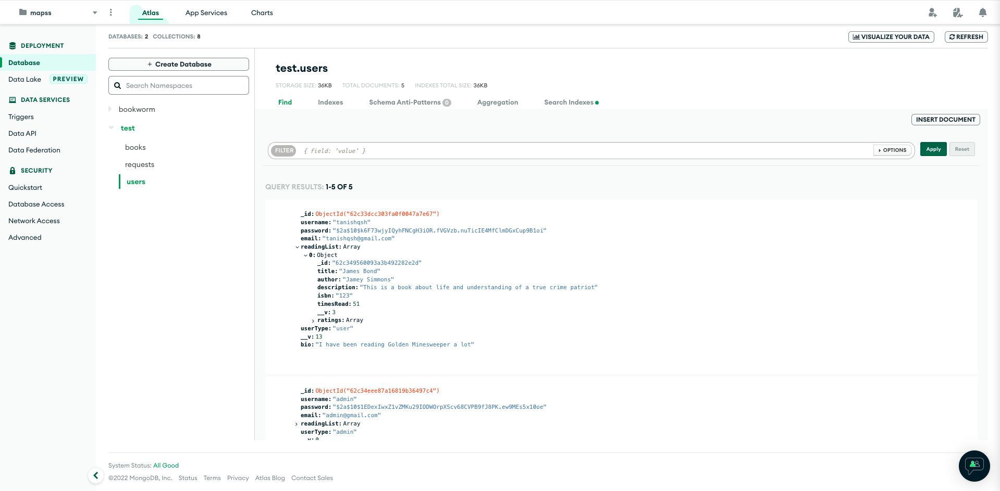
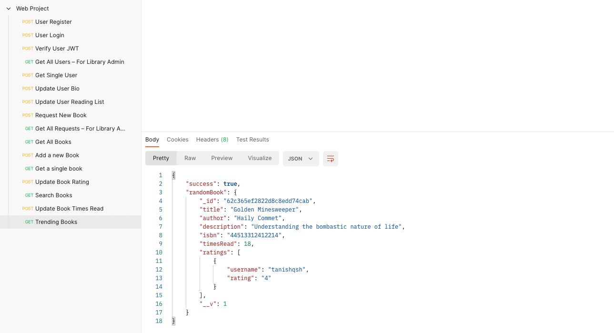

# React Project Submission

> Samantha Marino - N01356542
> Merrybeth Alibadbad - N01436057
> Balraj Singh - N01415998
> Tanishq Sharma - N01452308
> Chaitanya Pavuluri - N01452744

---

## Task List

-   [x] Login and registration page by Tanishq
-   [x] Reading Profile by Tanishq
-   [x] Request Form by Samantha
-   [x] Inventory Page by Balraj
-   [x] Book Browser by Chaitanya
-   [x] Rating System by Samantha
-   [x] Reading list by Merrybeth
-   [x] Reading Radar by Balraj
-   [x] Search Bar by Chaitanya
-   [x] Book Generator by Merrybeth

**As instructed, 2 features each**

---

## Resources

-   For Designing, We have used [TailwindCSS](https://tailwindcss.com/) library. Tailwind is a utility-first CSS framework packed with classes like flex, pt-4, text-center and rotate-90 that can be composed to build any design, directly in your markup.
-   For Deployment, We have used Heroku and localhost.
-   For Backend, We have used ExpressJS. The source code is available here [`Server Code`](https://github.com/tanishqalt/bookworm-internal)

---

## Learning Curve & Challenges

-   Primary challenge – Difficulties felt during routing, managing state, managing context and understanding the flow of the application.
-   Learning curve – Learnt about express, axios, useEffect, JWT token, tailwind, router, higher ordered component, conditional routing, heirarchy.

---

## Database

-   We have used MongoDB Atlas for our database.

Book model

```
const mongoose = require('mongoose');

const bookSchema = new mongoose.Schema({
    title: {
        type: String,
        required: true,
    },
    author: {
        type: String,
        required: true,
    },
    description: {
        type: String,
        required: true,
    },
    isbn: {
        type: String,
    },
    timesRead: {
        type: Number,
        default: 0,
    },
    ratings: {
        type: Array,
    }
}
);

const Book = mongoose.model('Book', bookSchema);

// index on the book title
bookSchema.index({ title: 'text' });

// create index
Book.createIndexes();


module.exports = Book;
```

User Model

```
const mongoose = require('mongoose');

const userSchema = new mongoose.Schema({
    username: {
        type: String,
        required: true,
    },
    password: {
        type: String,
        required: true,
    },
    email: {
        type: String,
        required: true,
    },
    bio: {
        type: String,
    },
    readingList: {
        type: Array,
        default: [],
    },
    userType: {
        type: String,
        default: 'user',
    }
})

const User = mongoose.model('User', userSchema);
module.exports = User;
```

RequestModel

```
/**
 *  A simple database model that stores username, email, book title, and book author.
 */

const mongoose = require('mongoose');


const requestSchema = new mongoose.Schema({
        username: {
            type: String,
        },
        bookTitle: {
            type: String,
        },
        bookAuthor: {
            type: String,
        }
    }
);

const BookRequest = mongoose.model('Request', requestSchema);

module.exports = BookRequest;
```



## Testing

-   We tested our APIs on localhost using Postman.


